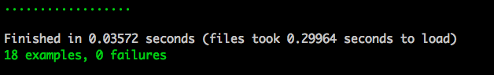
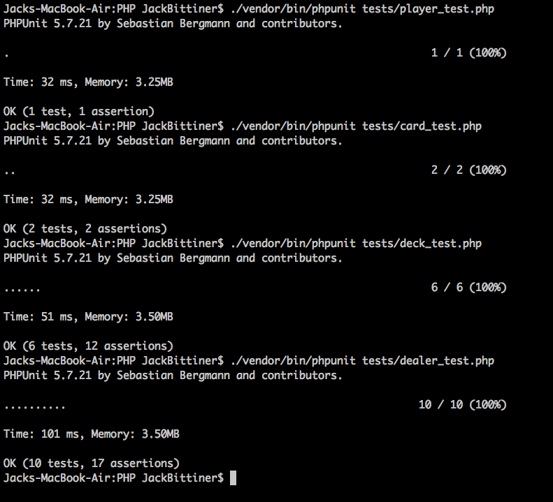

# Deck Of Cards

## The Challenge:

The scenario is as follows:
You have a deck of 52 cards, comprised of 4 suits (hearts, clubs, spades and diamonds) each with 13 values (Ace, two, three, four, five, six, seven, eight, nine, ten, jack, queen and king).
There are four players waiting to play around a table.
The deck arrives in perfect sequence (so, ace of hearts is at the bottom, two of hearts is next, etc. all the way up to king of diamonds on the top).

The task is a simple one: Please create a simple command line program that when executed recreates the scenario above and then performs the following two actions:
Shuffle the cards  - We would like to take the deck that is in sequence and shuffle it so that no two cards are still in sequence.
Deal the cards - We would then like to deal seven cards to each player (one card to the each player, then a second card to each player, and so on)

## User Stories

```
As a dealer,
so that I have cards to deal
I would like a fresh pack of cards given to me with each card suit and value in perfect sequence.
```

```
As a dealer,
so that I can deal cards for a game,
I would like 4 players that I can deal to.
```

```
As a dealer,
so that I can randomise the cards that I deal,
I would like to be able to shuffle the deck so that no two cards are in sequence.
```

```
As a dealer,
so that I can deal cards to players,
I would like to be able to deal 7 cards to each player one at a time.
```

#### Additional User Stories

```
As a dealer,
so that I can deal again,
I would like to be able to get the cards back that I have dealt.
```

```
As a dealer,
so that I don't ruin a game of cards,
I don't want to be able to deal if the cards are unshuffled.
```

```
As a dealer,
so that I don't ruin a game of cards,
I don't want to be able to deal cards if the players already have cards.
```


### Two Tech Tests Are Better Than One

I took on this challenge twice. Once in Ruby and once in PHP.
I wrote the Ruby one first to showcase my ability to write clean code and that I follow the key principles of an Object-Oriented Language.
I then wrote the PHP one to show my ability to pick up a new language quickly.

## How I Solved It

I broke the problem down into its simplest parts and ensure that I stuck to good SOLID principles. Ultimately, I had four classes: Card, Deck, Player and Dealer.

The __Player__ Class: This is responsible for having a hand. This is either empty or has seven cards when it is dealt to.

The __Card__ Class: This is responsible of having a rank and a suit.

The __Deck__ Class: This is responsible for holding 52 unique cards. It is initialized in perfect sequence. It is also responsible for shuffling the cards so that no two cards
are in sequence. In order to do this I created an array of arrays including every card and the card that follows it in sequence. Once the deck is shuffled I see if any of the
card sequences are contained in the deck. If there is a sequence in the deck then I shuffled again.

The __Dealer__ Class: This is the main class that runs the entire program. The dealer has four players to deal to and a deck of cards. The dealer can shuffle the cards then deal
one card at a time to each player until each player has seven cards. The dealer can't deal if the pack is unshuffled or they have already dealt cards. If the dealer wants to deal
again, they can return the players' cards to the deck.

## How To Run In Ruby

To access the Ruby files, type in the following:

```
cd Ruby
```

Open a REPL of your choice in the terminal: I personally use 'pry'

Then type in the following commands to require the necessary files:

```
require './lib/card'
require './lib/deck'
require './lib/player'
require './lib/dealer'
```

The following sequence of commands will showcase the entire program:
#anything that follows a hash is a comment and tells you what the command does.

```
dealer = Dealer.new
#creates a new dealer with deck of cards and players

dealer.deal_cards
#raises error as deck is unshuffled

dealer.shuffle_deck
#shuffles the cards

dealer.deal_cards
#deals 7 cards to each player

dealer.deal_cards
#raises error as players already have cards

dealer.return_cards_and_shuffle
#returns players cards to deck and shuffles
```

### Tests In Ruby

This program was Test-Driven. To run the tests type in rspec in the terminal in the Ruby directory. You should
see the following:



(ZERO FAILURES! ALL GREEN! A very satisfactory sight!)

## How To Run In PHP

```
cd PHP
```

Open up the REPL by typing this in the terminal:

```
php -a
```

Then type in the following command to require the necessary files:

```
require './src/dealer.php';
```

The following sequence of commands will showcase the entire program:
//anything that follows a double slash is a comment and tells you what the command does.

```
$dealer = new Dealer;
//creates a new dealer with deck of cards and players

$dealer->dealCards();
//raises error as deck is unshuffled

$dealer->shuffleDeck();
//shuffles the cards

$dealer->dealCards();
//deals 7 cards to each player

$dealer.dealCards();
//raises error as players already have cards

$dealer->returnCardsAndShuffle();
//returns players cards to deck and shuffles
```

### Tests In PHP

This program was Test-Driven. To run the tests type in the following commands in the terminal in the PHP directory:

```
./vendor/bin/phpunit tests/player_test.php

./vendor/bin/phpunit tests/card_test.php

./vendor/bin/phpunit tests/deck_test.php

./vendor/bin/phpunit tests/dealer_test.php
```

You should see the following:



(ZERO FAILURES! NOT SO GREEN! Still a very satisfactory sight!)
